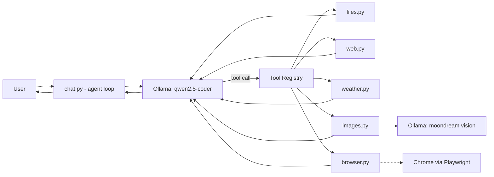

# Local AI Agent

A tool-calling AI agent that runs entirely on your machine. It plans and executes multi-step actions — searching the web, checking real-time weather, finding and verifying images, and driving a real Chrome browser — using a local LLM served by [Ollama](https://ollama.com), with no cloud API and no API keys.

The agent converses in Romanian; everything under the hood (code, architecture) is in English.

## Features

- **Multi-step tool-calling loop** — the agent chains multiple actions per request (e.g. open a page, click a button, read the result, then answer) instead of stopping after a single tool call.
- **Fully local and private** — inference runs on-device through Ollama; no data leaves the machine.
- **Resilient tool-call parsing** — supports both native OpenAI-style `tool_calls` and smaller models that occasionally emit function calls as raw JSON text instead.
- **Web search grounding** via DuckDuckGo Lite, so the agent can answer with current information instead of guessing.
- **Real-time weather** via the Open-Meteo API (geocoding + live conditions).
- **Image search with visual verification** — candidate images (via the Openverse API) are captioned by a local vision model and cross-checked by the text model before being saved, instead of trusting the first search result blindly.
- **Browser automation** via Playwright — open pages, click elements by CSS selector or visible text, fill in forms, press keys, read visible page content, take screenshots.
- **Local file tools** — read and write files on disk.

## Architecture



Each tool module owns both its implementation and its OpenAI-style function schema, so the two never drift apart. `tools/__init__.py` assembles them into a single registry the agent loop calls against.

```
local-ai-agent/
├── main.py            # entry point
├── chat.py            # agent loop, system prompt, tool-call dispatch
├── config.py          # model names, Ollama client, shared constants
└── tools/
    ├── files.py        # read/write local files
    ├── web.py          # web search (DuckDuckGo Lite)
    ├── weather.py      # live weather (Open-Meteo)
    ├── images.py       # image search + vision-verified download
    └── browser.py      # Chrome automation (Playwright)
```

## Tech Stack

| Purpose | Technology |
|---|---|
| Language | Python 3.11 |
| LLM runtime | [Ollama](https://ollama.com) (local, no cloud) |
| Reasoning / tool-calling model | `qwen2.5-coder:7b` |
| Vision model | `moondream` |
| LLM client | OpenAI Python SDK (pointed at Ollama's OpenAI-compatible endpoint) |
| Browser automation | Playwright (Chrome) |
| Weather data | Open-Meteo API |
| Image search | Openverse API |
| Web search | DuckDuckGo Lite |

## Getting Started

### Prerequisites

- Python 3.10+
- [Ollama](https://ollama.com) installed and running locally
- The required models pulled:

```bash
ollama pull qwen2.5-coder:7b
ollama pull moondream
```

### Installation

```bash
git clone https://github.com/<your-username>/local-ai-agent.git
cd local-ai-agent
pip install -r requirements.txt
playwright install chromium
```

### Run

```bash
python main.py
```

## Example Session

```
Agent Web & Sistem pregătit.
Scrie 'exit' ca să oprești.
==================================================

Tu: cate grade sunt in Cluj-Napoca acum

Execut: get_current_weather({'city': 'Cluj-Napoca'})
Agent: În Cluj-Napoca acum sunt 25.9 grade Celsius.

Tu: descarca-mi o poza cu o vulpe pe desktop

Execut: download_image({'query': 'vulpe', 'filename': 'vulpe.jpg'})
Agent: Poza cu vulpea a fost descărcată și verificată vizual.
```

## Demo

_Screenshots go in `docs/screenshots/` — add your own captures and reference them here, for example:_

```


```

## Engineering Notes

A few non-obvious problems came up while building this:

- **Search endpoint blocked by bot detection.** DuckDuckGo's HTML search endpoint started returning a CAPTCHA challenge page instead of results. Switched to the lite endpoint and rewrote the parser to anchor on the numbered result markers in the page rather than a fixed line offset, which broke the moment the page layout shifted.
- **The small local model doesn't always use native tool-calling.** `qwen2.5-coder:7b` sometimes returns a function call as a plain JSON string in the message content instead of populating the API's native `tool_calls` field. The agent loop detects and parses both forms so they funnel into the same execution path.
- **"First result" isn't "correct result."** Openverse matches search terms against image titles and descriptions — including long museum catalog metadata — not the actual visual content, so a query like "vulpe" (fox) could return a wooden pipe whose catalog description happens to mention a fox somewhere in a paragraph. Fixed with a three-part approach: stripping filler words down to the core keyword, biasing toward photography sources, and adding a local vision model that describes each candidate so the text model can confirm it actually matches before anything is saved.

## Limitations

- Tool selection and argument extraction run on a small 7B local model — reliability can drop on ambiguous or unusually phrased requests, compared to a larger or cloud-hosted model.
- Visual verification relies on a lightweight vision model and simple caption matching, not full object-detection accuracy.
- Built as a personal/portfolio project for local experimentation, not hardened for production, multi-user, or untrusted-input use.

## License

MIT — see [LICENSE](LICENSE).
